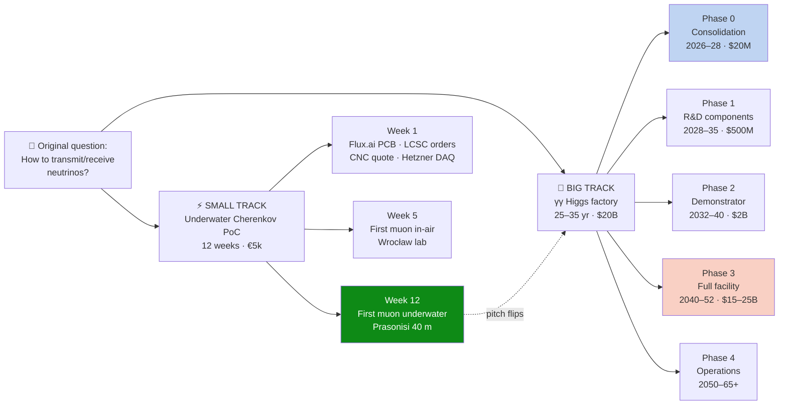
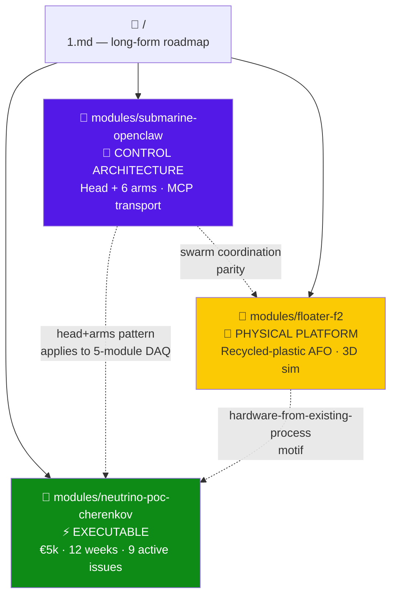
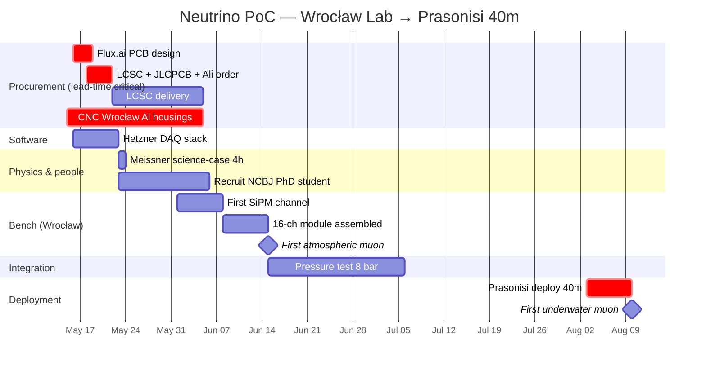
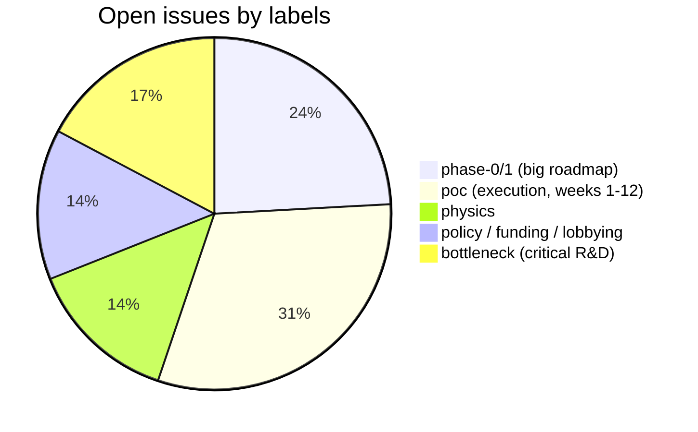
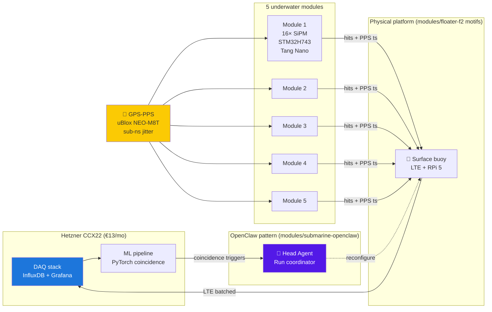
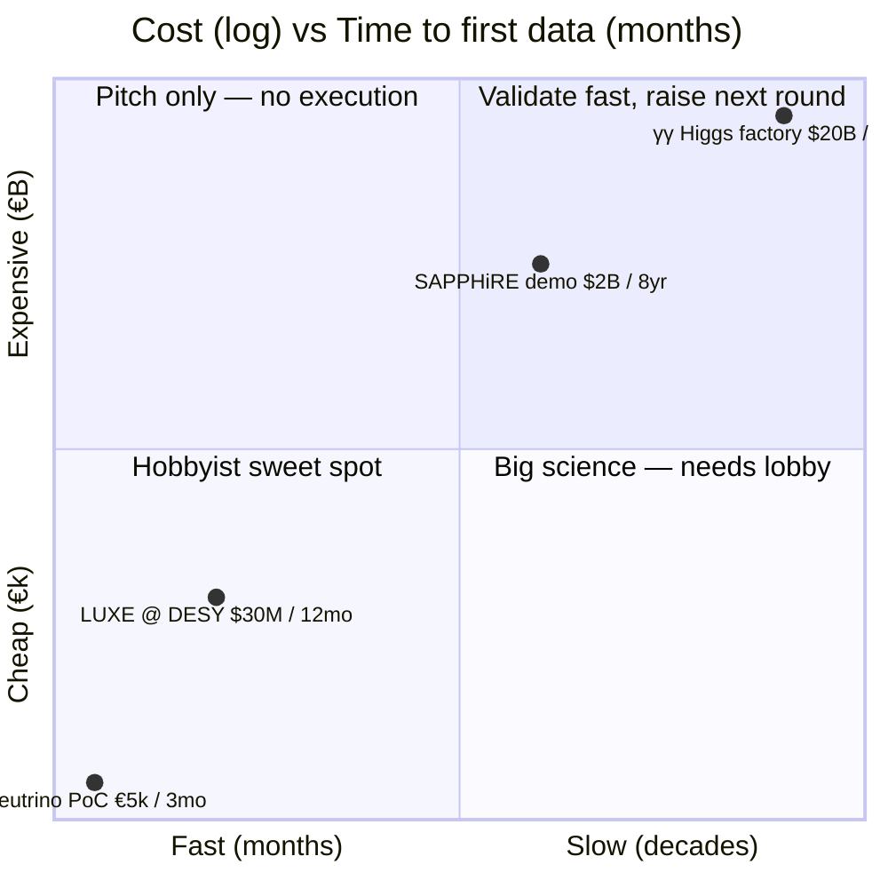

# γγ Collider Roadmap — Big Vision, Cheap Execution

> *Original question (2026-05-13): "How to transmit neutrino/neutrina? I need RX and TX and 'network' adapter. Quantum telecommunications?"*
>
> **This repo is the two-track answer.** Build the receiver this autumn for €5k. Plan the transmitter (a γγ Higgs factory) for the 2050s, $20B.

[](#status) [](./1.md) [](./modules/neutrino-poc-cherenkov/) [](#license)

---

## 🗺️ Two tracks, one repo



The small track **funds** the big track. Ship €5k PoC → preprint → flip the VC pitch from *"give us €100k for research"* to *"give us €2M to scale 5 → 500 modules and book KM3NeT"*.

---

## 📦 Module map



| Module | Role | Origin | Status |
|---|---|---|---|
| **[neutrino-poc-cherenkov](./modules/neutrino-poc-cherenkov/)** | Executable PoC — SiPM Cherenkov array | new, this session | 🟢 9 issues, W1 active |
| **[submarine-openclaw](./modules/submarine-openclaw/)** | Multi-agent arm control architecture | imported from [dontriskit/submarine](https://github.com/dontriskit/submarine) | 🟣 reference |
| **[floater-f2](./modules/floater-f2/)** | Autonomous floating object (recycled ocean plastic) + 3D simulator | imported from [asdfgh0318/FLOATER-F2](https://github.com/asdfgh0318/FLOATER-F2) | 🟡 reference |

---

## ⚡ The 12-week PoC plan (active)



### Critical path — W1 (this week)

| # | Owner | Task | Lead time |
|---|---|---|---|
| [#16](../../issues/16) | Adam | **Flux.ai** front-end PCB → JLCPCB | weekend → 10d JLCPCB |
| [#18](../../issues/18) | Maksym | LCSC + JLCPCB + AliExpress orders | 14d LCSC, 21d Ali |
| [#20](../../issues/20) | Kamil | CNC Wrocław quote × 5 Al housings | 21d CNC |
| [#21](../../issues/21) | Maksym | Hetzner CCX22 + DAQ skeleton | parallel |

---

## 📋 Issue dashboard



**[Full open issue list →](../../issues)**

### Big-track issues (γγ collider, long horizon)

| # | Topic | Phase | Labels |
|---|---|---|---|
| [#1](../../issues/1) | CDR outline & TOC | 0 | phase-0, policy |
| [#2](../../issues/2) | SRF vs plasma wakefield vs hybrid | 0 | bottleneck |
| [#3](../../issues/3) | Electron linac 125 GeV beam spec | 1 | accelerator |
| [#4](../../issues/4) | **50 kW ps laser feasibility** | 1 | bottleneck, laser |
| [#5](../../issues/5) | Spent-electron beam dump | 1 | bottleneck |
| [#6](../../issues/6) | Detector concept (ILD/SiD reuse) | 1 | detector |
| [#7](../../issues/7) | Femtosecond laser-electron sync | 1 | bottleneck, laser |
| [#8](../../issues/8) | SAPPHiRE-style demonstrator | 2 | accelerator |
| [#9](../../issues/9) | Full-scale site & civil | 3 | accelerator |
| [#10](../../issues/10) | γγ→H width measurement to 1% | — | physics |
| [#11](../../issues/11) | Strong-field QED program | — | physics |
| [#12](../../issues/12) | BSM portfolio (ALPs, dark photon) | — | physics |
| [#13](../../issues/13) | **Lobbying & funding strategy** | — | bottleneck, policy |
| [#14](../../issues/14) | Phase 0/1 funding stack | — | policy |
| [#15](../../issues/15) | Back LUXE @ DESY engagement | — | physics |

### Small-track issues (PoC, this autumn)

| # | Week | Owner | Task |
|---|---|---|---|
| [#16](../../issues/16) | W1 | Adam | **Flux.ai** front-end PCB |
| [#21](../../issues/21) | W1 | Maksym | Hetzner DAQ stack |
| [#20](../../issues/20) | W1-2 | Kamil | CNC Al housings + surplus |
| [#18](../../issues/18) | W1 | Maksym + Adam | LCSC/JLCPCB/Ali orders |
| [#19](../../issues/19) | W2 | Meissner | 4h science-case session |
| [#24](../../issues/24) | W2-3 | Maksym | Recruit NCBJ PhD student |
| [#23](../../issues/23) | W3-5 | Adam + Maksym | Bench → first muon in-air |
| [#17](../../issues/17) | W6-10 | Kamil + Adam | Pressure test 8 bar |
| [#22](../../issues/22) | W11-12 | team | **Prasonisi deploy, first underwater muon** |

---

## 🏗️ Architecture — how the modules compose



**Key points:**
- **Timing:** GPS-PPS gives sub-nanosecond synchronization across all 5 modules — no White Rabbit (€20k) needed.
- **Transport:** SiPM hits → STM32 batching → CAT6+power tether → surface buoy → LTE → Hetzner. NO custom protocol; HTTP POST with msgpack.
- **Coincidence:** done in post-processing on Hetzner, not in firmware. Storage is cheap; latency is irrelevant for muons.
- **OpenClaw analogy:** the head agent watches DAQ and can reconfigure (raise threshold, swap arm, retry); 5 modules act as the "arms" with shared on-disk memory.

---

## 💰 Budget vs schedule, two tracks



---

## 🚀 Status

- ✅ **Repo created**, pushed to `main`
- ✅ **24 issues filed** (15 roadmap + 9 PoC execution)
- ✅ **3 modules merged**: neutrino-poc-cherenkov (new), submarine-openclaw (imported), floater-f2 (imported)
- ⏳ **Collaborator invite** sent to [@dontriskit](https://github.com/dontriskit) — pending acceptance
- ⏳ **W1 tasks** assigned to [@asdfgh0318](https://github.com/asdfgh0318) as caretaker until invite accepted

### After dontriskit accepts the invite

```bash
for n in $(seq 1 24); do
  gh issue edit $n --repo asdfgh0318/gamma-gamma-collider-roadmap --add-assignee dontriskit
done
```

---

## 📁 Repo layout

```
gamma-gamma-collider-roadmap/
├── README.md                          # this file
├── CLAUDE.md                          # AI agent guidance
├── 1.md                               # long-form γγ roadmap (the prompt)
└── modules/
    ├── neutrino-poc-cherenkov/        # ⚡ executable PoC
    │   ├── MODULE.md
    │   └── PoC-BOM.md
    ├── submarine-openclaw/            # 🤖 control architecture
    │   ├── MODULE.md
    │   ├── ARCHITECTURE.md
    │   ├── README.md
    │   └── apps/jared-octopus/arms/   # 6 arm subdirs
    └── floater-f2/                    # 🌊 physical platform
        ├── MODULE.md
        ├── README.md
        ├── plan.md
        ├── simulator/index.html       # live 3D Three.js ocean sim
        └── sim-*.png                  # screenshots
```

---

## 🔗 External links

- **Flux.ai** — AI-assisted PCB design used in [#16](../../issues/16): https://www.flux.ai
- **LUXE @ DESY** — strong-field QED demonstrator we ride: https://luxe.desy.de
- **KM3NeT** — neutrino telescope we aim to contract with after PoC: https://www.km3net.org
- **SAPPHiRE** (CERN concept 2012): https://arxiv.org/abs/1208.2827
- **Onsemi MicroFJ-30035** SiPM datasheet: https://www.onsemi.com/products/sensors/silicon-photomultipliers-sipm/microfj-30035
- **uBlox NEO-M8T** GPS w/ PPS: https://www.u-blox.com/en/product/neo-m8t-series
- **Hetzner CCX22**: https://www.hetzner.com/cloud
- **dontriskit/submarine** (origin of OpenClaw): https://github.com/dontriskit/submarine
- **asdfgh0318/FLOATER-F2** (origin of floater module): https://github.com/asdfgh0318/FLOATER-F2

---

## License

MIT — see individual modules for original-author attribution. Architecture proposed by **Jared (OS-1 agent)** for OpenClaw; FLOATER F² and γγ roadmap by **Maksym** (asdfgh0318). Imports and integrations 2026-05-14.

> *"Floating plastic is the problem. Floating plastic is the plan B."*  — FLOATER F²
>
> *"Reszta to lutowanie i listing latania."* — PoC plan
