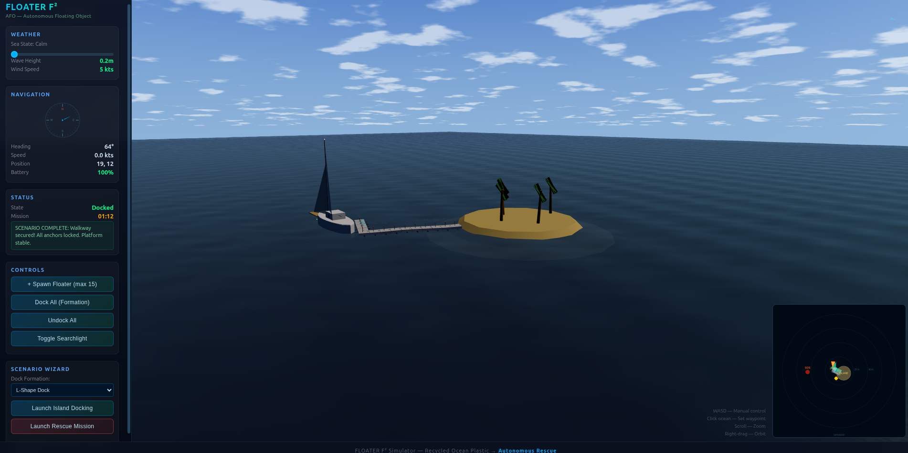
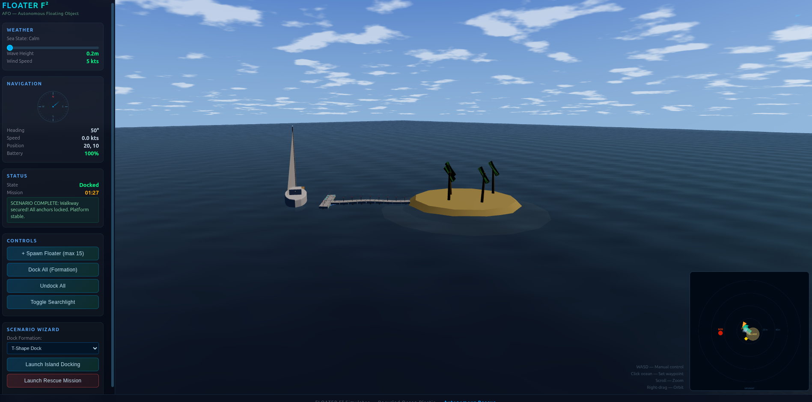
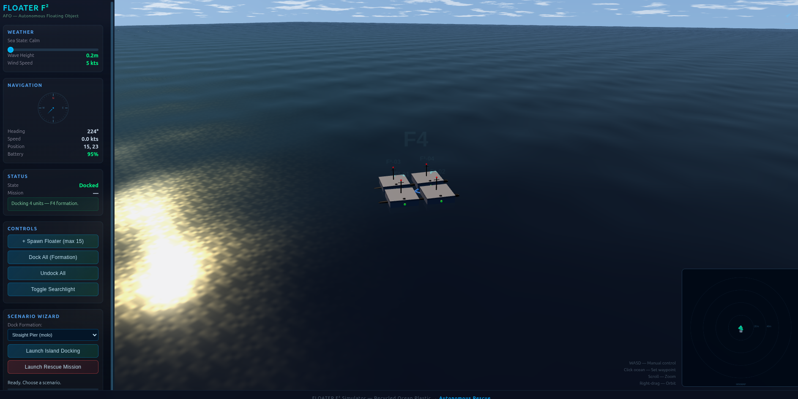
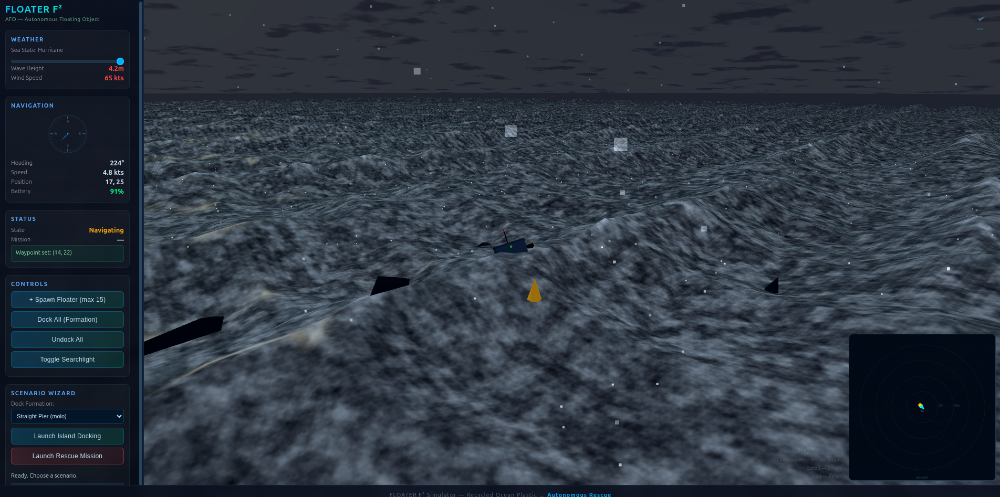

# FLOATER F² — Autonomous Floating Object

**AFO — Autonomous Floating Object**

**Floating plastic is the problem. Floating plastic is the plan B.**

Turn ocean plastic waste into autonomous rescue platforms. 1m x 1m x 45cm. Modular. Dockable. Built to survive.

---

### Prototype & Design Notes

---

## Simulator

Live 3D ocean simulator — open `simulator/index.html` in any browser. No build step, no dependencies — pure HTML + Three.js ES modules from CDN.

### Pier Dock — 15 floaters forming a walkway from island to sailboat

### Island Docking Scenario — completed pier with sailboat parked at the end

### F5 Formation — 5 floaters docked in cross pattern with searchlight active

### Hurricane Weather — Gerstner wave storm with spray and foam

### Features

**Ocean & Weather**
- Gerstner wave ocean (6 wave components in vertex shader)
- Weather slider: calm → moderate → storm → hurricane
- Spray and rain particle systems in storms
- Fresnel reflection, subsurface scattering, multi-layer foam
- Dynamic sky dome with clouds, sun glow, storm darkening

**Navigation & Controls**
- Click-to-navigate with WASD manual override
- Compass, wind indicator, battery, mission timer
- 280px minimap with unit IDs, SOS markers, waypoint crosshairs

**Docking & Formations**
- Up to 15 autonomous floaters
- Port-to-port docking (front + back ports, 1.04m spacing)
- 5 dock formations: straight pier, full surround, L-shape, T-shape, horseshoe
- Live reconfiguration — switch dock type on the fly
- Dock connectors and formation labels

**Island Docking Scenario**
- Sailboat with sails, mast, nav lights, sail flutter animation
- Island with sand mound, beach, palm trees
- 15-unit fleet follows sailboat to island
- Floaters form pier/molo from shore to boat
- Spiral anchor drill system (1m helix, rocking lock into sand)
- Scenario wizard with 4-phase progress bar

**Rescue Mission**
- Survivor with distress beacon, arm-waving animation
- Gatewood Cape deployment (expanding shelter circle)
- Inflatable pad deployment
- Cinematic camera follow
- Searchlight with visible volumetric beam cone

---

## Versions

### Research / Rescue Mission
- Top-mounted instrument deck
- [RadioMicroscope](../RadioMicroscope/) antenna tracker (2-DOF WiFi/signal tracker, ESP32S3 + directional antenna + IMU)
- Gatewood Cape (Six Moon Designs, 310g / 11oz ultralight poncho-shelter, 360° protection, 1800mm waterproof)
- Ultralight inflatable pad (Nemo Tensor class, ~245g / 8.6oz, packs to 27cm x 10cm)
- AI pattern recognition (camera, thermal, radar — obstacle avoidance, survivor detection, weather assessment)
- Bright LED searchlight for night operations

### Cargo / Expedition
- Flat top with body-integrated solar panels
- Payload deck for supplies, sensors, or equipment
- Front + back docking ports — multiple units link into trains/rafts

---

## Core Specs

| Parameter | Value |
|-----------|-------|
| Dimensions | 1m x 1m x 45cm |
| Hull | White recycled ocean plastic with solar panel top |
| Propulsion | 2x side-mounted thrusters (sealife-safe — needs R&D) |
| Power | Li-ion primary + body-integrated solar panels |
| Docking | Front + back ports (1.04m port-to-port chain spacing) |
| Navigation | AI pattern recognition + RadioMicroscope signal tracking |
| Survivability | Hurricane-rated hull design |
| Anchoring | 1m spiral drill anchors (4-turn helix, rocking lock) |

---

## Rescue Mission Loadout

When deployed to a rescue:
- **RadioMicroscope** locks onto distress signals and guides navigation
- **Gatewood Cape** provides immediate 360° weather shelter for survivor
- **Inflatable pad** provides insulation from cold water/hypothermia
- **Searchlight** with volumetric beam for night visibility and signaling
- Combined rescue gear weight: ~555g (~1.2 lbs)

---

## The Core Idea

Ocean plastic is one of the biggest environmental disasters on the planet. It floats, it persists, it kills marine life. **FLOATER F² turns that problem into a solution** — collect it, recycle it into hulls, and deploy autonomous rescue platforms made from the very waste that was polluting the ocean.

Every Floater on the water is plastic that's no longer choking the sea. And when someone needs rescuing, that recycled plastic shows up as plan B.

---

## Experimental / Future Ideas

- **Plastic-to-energy:** burning collected ocean plastic for supplemental power (needs R&D on emissions/filtration)
- **Deployable anchor:** solar-powered station-keeping with wave energy generator
- **Island pier docking:** 15+ floaters form walkways connecting islands to boats
- **Signal relay:** RadioMicroscope as mesh network node for ocean-wide comms

---

## Related Projects

- [RadioMicroscope](../RadioMicroscope/) — 2-DOF antenna tracker, ESP32S3, pan-tilt gimbal, WiFi RSSI mapping

---

## Project Files

- [1.md](1.md) — Original concept prompt
- [plan.md](plan.md) — Development plan
- [pitch.html](pitch.html) — HTML pitch deck
- [orchestration.html](orchestration.html) — Agent orchestration flow diagram
- [simulator/index.html](simulator/index.html) — Live 3D simulator

---

*FLOATER F² — because the ocean doesn't wait.*
