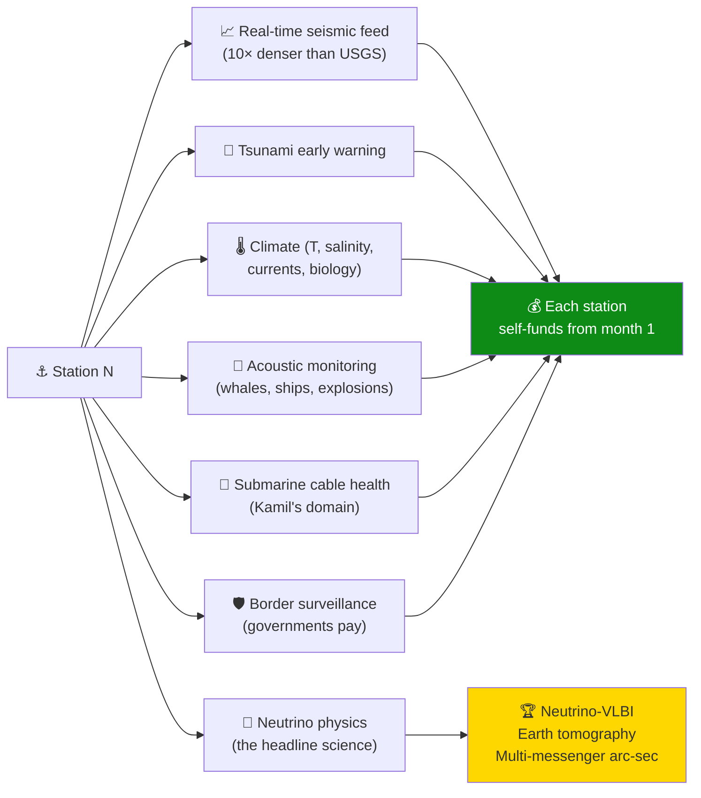

# Module: global-network

The **strategic** module. Where [[neutrino-poc-cherenkov]] is the executable 12-week PoC and [[/1.md]] is the 25-year γγ collider vision, this module is the **20-year scaling path** between them: from one underwater detector in Prasonisi to a **mobile + distributed global network** of 12 stations doing neutrino-VLBI and Earth tomography.

## Why it lives in this repo

The user's recurring opening question — *"How to transmit neutrino/neutrina?"* — has now been answered three different ways in this repo:

| Module | Horizon | Cost | Answer to the question |
|---|---|---|---|
| `/1.md` (γγ collider roadmap) | 25–35 yr | $20B | Build the *transmitter* (high-energy collisions emitting calibrated neutrino secondaries) |
| [[neutrino-poc-cherenkov]] | 12 weeks | €5k | Build the *receiver* (underwater Cherenkov detector) |
| **this module** | 20 yr | self-funding (commercial Day 1) | Build the *network* (mobile + distributed, neutrino-VLBI, Earth tomography) |

All three are correct. This module is the **bridge from receiver to instrument class** — the *new category of physics tool* that the user identified as the strategic paradigm shift.

## What's here

- **`STRATEGY.md`** — full strategic content: Track A (mobile towed array), Track B (12-station distributed), synthesis (mobile servicing distributed), 20-year phased roadmap, Metcalfe's-law value argument, what separates this from KM3NeT/IceCube forever
- Network diagrams (mermaid) — proposed 12 stations grouped by build tier
- 20-year Gantt chart

## Cross-module map

| This module | Connects to |
|---|---|
| Phase 0–1 station build | [[neutrino-poc-cherenkov]] — the PoC *is* the first station's school run |
| Mobile servicing fleet | Hardbox core business (autonomous underwater vehicles) — the strategic moat |
| 5-module DAQ at each station | [[submarine-openclaw]] head+arms pattern, scaled to 1000–10000 modules |
| Surface buoy at each station | [[floater-f2]] platform motif (recycled-plastic hull, body solar, dockable, hurricane-survivable) |
| Multi-station coincidence triangulation | Same physics as γγ-collider issue [#7](../../issues/7) (fs-level sync) but at 10,000 km baseline instead of 10 km |
| Funding via commercial data streams | Issue [#14](../../issues/14) — sustainability/green-grid narrative scales to "ocean-monitoring infrastructure" |

## The "Ocean Internet" framing

Every station produces 10–20 commercially valuable data streams **before neutrinos are touched**:

## Open strategic decisions (filed as issues)

The user's "which next" question is filed as three issues — comment on whichever should be driven first:

- **Mobile streamer architecture** — concrete towed-array design
- **Strategic location map** — which station when, partnerships, diplomacy
- **Multi-layer business model** — JV structure, federation governance

See `../../issues?q=label%3Astrategy` for the live list.

## The strategic claim, distilled

> **One mobile unit manages a network of millions of modules.**
> **No other lab can match this without 30 years of being a maritime company.**
> **Hardbox accidentally built the moat before the physics needed it.**
> **Value ∝ N² (Metcalfe), not N.**

## Provenance

Authored 2026-05-14 from the user's strategic prompt 10 (full text preserved in [[/prompts.md]]).
